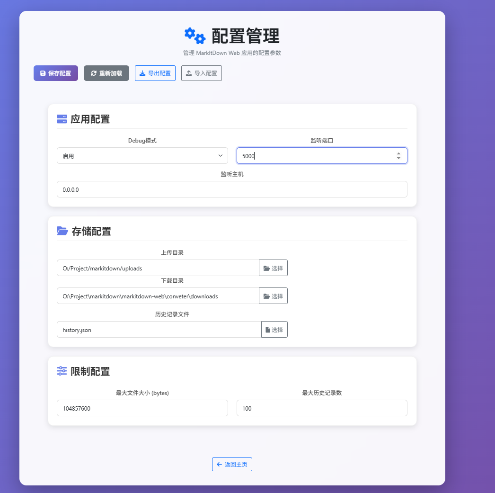

# MarkItDown 文档转换工具

[](https://opensource.org/licenses/MIT)
[](https://www.oracle.com/java/)
[](https://www.python.org/)
[](https://flask.palletsprojects.com/)

> 对微软开源项目 MarkItDown 的重写实现，将多种文件格式转换为 Markdown 格式，方便作为大模型语料使用

## 📋 项目概述

MarkItDown 是一个文档转换工具，对微软开源的 MarkItDown 项目进行重写实现，专门用于将各种格式的文档转换为 Markdown 格式。本项目提供两种重写实现方式：

1. **Java 命令行版本** (`markitdown-java`) - 轻量级命令行工具，适合资源有限的设备
2. **Python Web 版本** (`markitdown-web`) - 功能完整的 Web 应用，支持高级文档识别

### 🎯 主要特性

| 特性 | Java 版本 | Python Web 版本 |
|------|-----------|------------------|
| **运行环境** | 需要 JDK 17+ | 需要 Python 3.10+ |
| **PDF 处理** | ❌ 基础文本提取 | ✅ 智能版面分析 + OCR |
| **图片识别** | ❌ | ✅ PaddleOCR 高精度识别 |
| **用户界面** | 命令行 | Web 可视化界面 |
| **批量处理** | ✅ 命令行批量 | ✅ Web 界面批量 |
| **实时预览** | ❌ | ✅ 网页实时预览 |
| **资源占用** | 低 | 较高（需要 GPU 加速更佳） |
| **适用场景** | 服务器批量处理 | 桌面文档转换 |

## 🌟 Web 版本功能演示

### 🎯 核心功能展示

<br>

#### 📁 文件上传功能
<div style="margin: 20px 0; padding: 15px; border: 1px solid #e0e0e0; border-radius: 8px; background-color: #f9f9f9;">
  <h4>🚀 智能文件上传</h4>
  <p>• 拖拽上传支持，格式自动识别<br>
  • 实时上传进度显示<br>
  • 多文件批量上传<br>
  • 文件大小和格式验证</p>
  <p><strong>演示图片：</strong> <code>images/upload-demo.png</code></p>
</div>
<br>

#### 🔄 格式转换引擎
<div style="margin: 20px 0; padding: 15px; border: 1px solid #e0e0e0; border-radius: 8px; background-color: #f9f9f9;">
  <h4>⚡ 多格式转换支持</h4>
  <p>• 支持 PDF、Word、Excel、PPT 等 12+ 种文件格式<br>
  • PaddleOCR 智能版面分析<br>
  • 表格智能识别和重建<br>
  • 高保真格式转换</p>
  <p><strong>演示图片：</strong> <code>images/conversion-demo.png</code></p>
</div>

<br>

#### 👁️ 实时预览系统
<div style="margin: 20px 0; padding: 15px; border: 1px solid #e0e0e0; border-radius: 8px; background-color: #f9f9f9;">
  <h4>📖 即时结果预览</h4>
  <p>• 转换完成后立即预览 Markdown 效果<br>
  • 图片路径智能处理<br>
  • 格式化内容显示<br>
  • 支持原始 Markdown 和渲染预览</p>
  <p><strong>演示图片：</strong> <code>images/preview-demo.png</code></p>
</div>

<br>

#### 📦 批量处理能力
<div style="margin: 20px 0; padding: 15px; border: 1px solid #e0e0e0; border-radius: 8px; background-color: #f9f9f9;">
  <h4>📋 ZIP 批量转换</h4>
  <p>• 上传 ZIP 压缩包进行批量转换<br>
  • 实时进度监控和状态显示<br>
  • 转换失败文件错误报告<br>
  • 批量结果管理</p>
  <p><strong>演示图片：</strong> <code>images/batch-demo.png</code></p>
</div>

<br>

#### 📚 历史记录管理
<div style="margin: 20px 0; padding: 15px; border: 1px solid #e0e0e0; border-radius: 8px; background-color: #f9f9f9;">
  <h4>🕐 转换历史追踪</h4>
  <p>• 完整的转换历史记录<br>
  • 一键重新下载功能<br>
  • 历史记录搜索和过滤<br>
  • 批量管理操作</p>
  <p><strong>演示图片：</strong> <code>images/history-demo.png</code></p>
</div>

<br>

#### ⚙️ 配置管理系统
<div style="margin: 20px 0; padding: 15px; border: 1px solid #e0e0e0; border-radius: 8px; background-color: #f9f9f9;">
  <h4>🔧 动态配置管理</h4>
  <p>• 存储路径动态配置<br>
  • 文件迁移原子操作<br>
  • 配置热更新生效<br>
  • 系统参数调优</p>
  <p><strong>演示图片：</strong> <code>images/config-demo.png</code></p>
</div>

<br>

#### 🧠 PDF 高级处理
<div style="margin: 20px 0; padding: 15px; border: 1px solid #e0e0e0; border-radius: 8px; background-color: #f9f9f9;">
  <h4>📄 智能文档解析</h4>
  <p>• PaddleOCR PP-StructureV3 版面分析<br>
  • 表格智能识别和重建<br>
  • 图片提取和 OCR 识别<br>
  • 复杂文档结构保持</p>
  <p><strong>演示图片：</strong> <code>images/pdf-advanced-demo.png</code></p>
</div>

<br>

#### 🖼️ 图片 OCR 识别
<div style="margin: 20px 0; padding: 15px; border: 1px solid #e0e0e0; border-radius: 8px; background-color: #f9f9f9;">
  <h4>🔍 高精度文字识别</h4>
  <p>• PaddleOCR 高精度识别<br>
  • 中英文混合识别支持<br>
  • 多种图片格式支持<br>
  • 识别结果结构化输出</p>
  <p><strong>演示图片：</strong> <code>images/ocr-demo.png</code></p>
</div>

### 💡 使用场景示例

#### 📄 文档转换场景
- **学术论文**：PDF 论文转 Markdown，保留公式和表格结构
- **技术文档**：Word/PowerPoint 技术文档转换为纯文本格式
- **合同文件**：扫描版合同 PDF 通过 OCR 转为可编辑文本
- **会议资料**：批量转换 PPT、Word 等会议材料

#### 🔧 技术应用场景
- **AI 语料准备**：为大语言模型准备高质量的训练数据
- **文档归档**：将各种格式文档统一为 Markdown 格式存储
- **内容提取**：从 PDF、图片中提取结构化文本内容
- **批量处理**：企业级文档批量转换需求

#### 📱 移动办公场景
- **随时随地**：Web 界面支持各种设备访问
- **快速转换**：无需安装软件，直接在线转换
- **结果分享**：转换结果可直接复制或下载分享

## 🚀 快速开始

### Python Web 版本（推荐）

#### 环境要求

- Python 3.10 或更高版本
- PaddleOCR（建议使用 GPU 加速版本）
- 虚拟环境（推荐）

#### 安装步骤

```bash
# 1. 克隆项目
git clone https://github.com/DuanYan007/markitdown.git
cd markitdown/markitdown-web/conveter

# 2. 创建并激活虚拟环境（推荐）
# Windows
python -m venv venv
venv\Scripts\activate

# macOS/Linux
python3 -m venv venv
source venv/bin/activate

# 3. 升级 pip
pip install --upgrade pip

# 4. 安装PaddleOcr
# 50系显卡
python -m pip install paddlepaddle-gpu==3.2.1 -i https://www.paddlepaddle.org.cn/packages/stable/cu129/
python -m pip install -U "paddleocr[doc-parser]"
# 对于 Linux 系统，执行：
python -m pip install https://paddle-whl.bj.bcebos.com/nightly/cu126/safetensors/safetensors-0.6.2.dev0-cp38-abi3-linux_x86_64.whl
# 对于Windows 系统，执行：
python -m pip install https://xly-devops.cdn.bcebos.com/safetensors-nightly/safetensors-0.6.2.dev0-cp38-abi3-win_amd64.whl
# 40系待补充

# 4. 安装项目依赖
pip install -r requirements.txt

# 5. 验证 PaddleOCR 安装
python -c "import paddleocr; print('PaddleOCR 安装成功')"

# 6. 启动应用
python app.py
```

#### 访问应用

启动后，在浏览器中访问：
- 主页面：http://localhost:5000
- 配置管理：http://localhost:5000/config

### Java 命令行版本（轻量级备选）

#### 环境要求

- JDK 17 或更高版本
- Maven 3.6+

#### 安装使用

```bash
# 克隆项目
git clone https://github.com/DuanYan007/markitdown.git
cd markitdown/java

# 编译打包
mvn clean package -DskipTests

# 基本使用
java -jar target/markitdown-java.jar document.docx -o output.md

# 批量转换
java -jar target/markitdown-java.jar *.docx
```

#### 命令行选项

```bash
Usage: markitdown [OPTIONS] INPUT_FILES...

主要选项:
  -o, --output <FILE>      输出文件或目录
  --language <LANG>       OCR 语言 (默认: auto)
  -v, --verbose           详细输出
  -h, --help              显示帮助
```

## 📚 支持的文件格式

| 格式类别 | 支持扩展名 | Java 版本 | Python 版本 | 备注 |
|---------|------------|-----------|--------------|------|
| **Word** | .doc, .docx | ✅ Apache POI | ✅ python-docx | 保留格式和图片 |
| **Excel** | .xls, .xlsx | ✅ Apache POI | ✅ pandas + openpyxl | 表格转 Markdown |
| **PowerPoint** | .ppt, .pptx | ✅ Apache POI | ✅ python-pptx | 幻灯片内容提取 |
| **图片** | .jpg, .jpeg, .png, .gif, .bmp, .tiff, .webp | ❌ | ✅ PaddleOCR | OCR 文字识别 |
| **PDF** | .pdf | ❌ 基础文本提取 | ✅ PaddleOCR 智能识别 | Python 版效果优秀 |
| **音频** | .mp3, .wav, .ogg, .flac, .m4a, .aac | ✅ 元数据支持 | ✅ mutagen | 元数据提取 |
| **视频** | .mp4, .avi, .mov, .mkv, .wmv, .flv, .webm, .m4v | ❌ | ✅ ffmpeg | 元数据提取 |
| **HTML** | .html, .htm | ✅ jsoup | ✅ BeautifulSoup | 内容清理 |
| **CSV** | .csv | ✅ 原生解析 | ✅ pandas | 表格转换 |
| **JSON/XML** | .json, .xml | ✅ Jackson | ✅ 原生解析 | 代码块格式 |
| **文本文件** | .txt, .log, .md | ✅ 原生解析 | ✅ 原生解析 | 多种编码支持 |
| **压缩包** | .zip | ❌ | ✅ 批量处理 | 支持批量转换 |

## 🌐 Web 版本使用说明

### 主界面功能

MarkItDown Web 版提供简洁直观的用户界面：

1. **文件上传区域**：支持拖拽上传或点击选择文件
2. **格式选择**：根据文件扩展名自动识别格式，也可手动选择
3. **转换按钮**：一键开始转换过程
4. **实时预览**：转换完成后立即在网页中预览 Markdown 内容
5. **下载功能**：支持下载转换后的 Markdown 文件

### 使用流程

1. **启动应用**：`python app.py`
2. **访问主页**：http://localhost:5000
3. **上传文件**：
   - 拖拽文件到上传区域，或
   - 点击选择文件按钮
4. **开始转换**：系统自动识别格式并转换
5. **预览结果**：在网页中实时查看转换效果
6. **下载文件**：点击下载按钮获取 Markdown 文件

### 批量处理

- **压缩包上传**：支持上传 ZIP 文件进行批量转换
- **文件选择**：解压后可选择需要转换的特定文件
- **进度监控**：实时显示批量转换进度和状态
- **结果管理**：批量转换结果可在历史记录中查看

### 配置管理

访问 http://localhost:5000/config 可以：
- 修改存储路径（上传目录、下载目录）
- 调整文件大小限制
- 设置历史记录数量
- 配置文件会自动保存并立即生效

## 🏗️ 技术架构

### Python 版本 (markitdown-web)

- **PaddleOCR PP-StructureV3**：先进的 OCR 和文档版面分析
- **Flask**：轻量级 Web 框架
- **文件迁移系统**：原子性文件操作和配置热更新
- **图片路径处理**：智能处理网页预览和本地下载的路径兼容性

### Java 版本 (markitdown-java)

- **Apache POI**：Office 文档处理（Word、Excel、PPT）
- **PicoCLI**：命令行界面框架
- **Jackson**：JSON/XML 处理

## 🖼️ Web 版本演示

### 主界面预览


*主界面提供简洁的文件上传和转换功能*

### 功能特点

- **拖拽上传**：直接拖拽文件到上传区域
- **格式自动识别**：根据文件扩展名自动选择转换器
- **实时进度**：显示转换进度和状态
- **在线预览**：转换完成后立即预览 Markdown 内容
- **一键下载**：支持下载转换后的文件

### 配置界面



*配置界面支持动态修改存储路径和系统设置*

## 🤝 贡献

欢迎提交 Issue 和 Pull Request！

1. Fork 项目
2. 创建特性分支
3. 提交更改
4. 发起 Pull Request

## 📄 许可证

本项目基于 MIT 许可证开源。

## 🙏 致谢

感谢以下开源项目的支持：

- **[Microsoft MarkItDown](https://github.com/microsoft/markitdown)** - 原始项目灵感来源和技术基础
- **[PaddleOCR](https://github.com/PaddlePaddle/PaddleOCR)** - 优秀的 OCR 框架，提供高精度的文字识别能力
- **[Flask](https://flask.palletsprojects.com/)** - 轻量级且强大的 Web 框架
- **[Apache POI](https://poi.apache.org/)** - Java 版 Office 文档处理的核心支持
- **[Apache PDFBox](https://pdfbox.apache.org/)** - PDF 文档处理库
- **PicoCLI** - 现代化的命令行界面框架

## 👨‍💻 联系方式

- **作者**: duan yan
- **邮箱**: 2907762730@qq.com
- **GitHub**: [@DuanYan007](https://github.com/DuanYan007)
